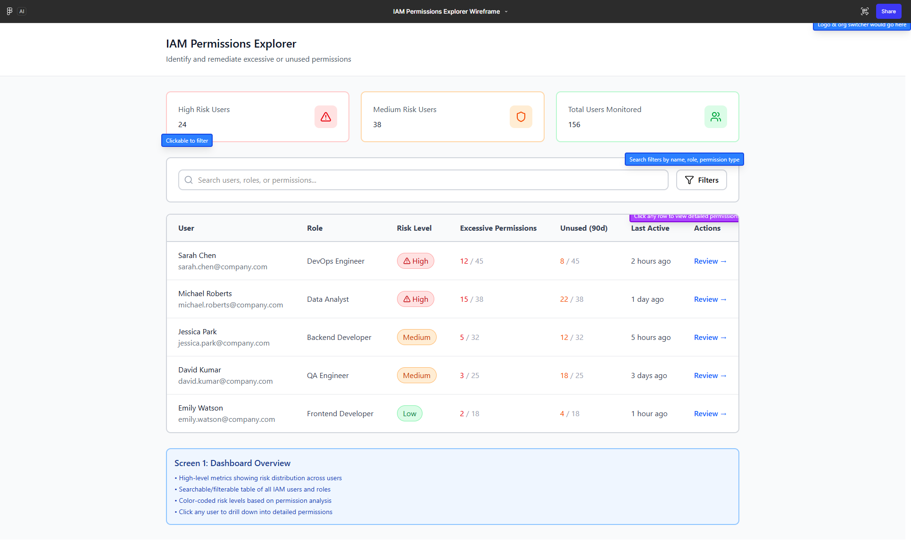
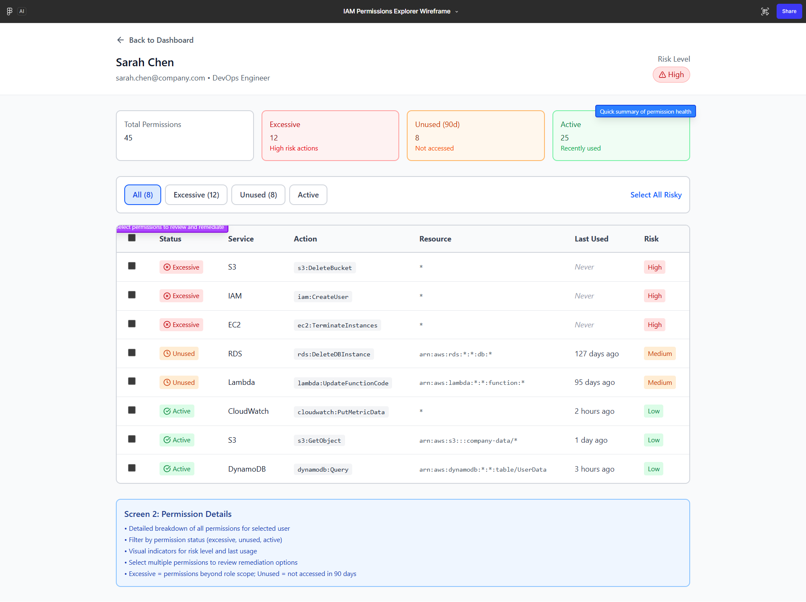
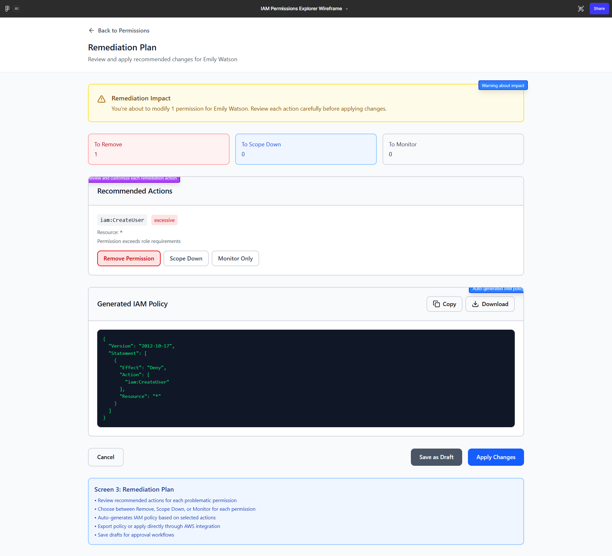

# IAM Permissions Explorer

**Made By:** Gaurav Sidharth Bharane  
**LinkedIn:** https://linkedin.com/in/gaurav-bharane

## 1. Problem Statement & User Persona

### Problem Statement
In cloud environments, IAM permissions tend to grow over time due to changing responsibilities, temporary access, and legacy policies. As a result, users and roles often end up with more permissions than necessary, increasing security risk and making audits difficult.

Cloud security engineers need a simple and reliable way to understand which permissions are actually being used, identify excessive access, and reduce it safely—without disrupting running systems. The objective of the IAM Permissions Explorer is to provide clear visibility into permission usage and support confident, informed access cleanup.

### User Persona: Cloud Security Engineer
- **Role:** Oversees IAM users, roles, and permissions across cloud accounts.
- **Responsibilities:** Performs access reviews and investigates permission risks.

#### Challenges
- Limited visibility into excessive and unused permissions
- Risk of service impact when reducing access

#### Goals
- Quickly identify high-risk identities from a central dashboard
- Review permission usage with confidence
- Safely reduce access while minimizing operational risk

## 2. Wireframes (Figma — 3 Screens)

Figma link: https://pack-bold-02064716.figma.site/

### Screen 1 — IAM Permissions Overview
**Purpose:** Provide a centralized dashboard that enables security engineers to quickly assess IAM risk across users and roles and prioritize reviews based on permission exposure.

**Key elements:**
- Risk summary cards (High / Medium / Total users)
- Search bar for quick lookup of users, roles, or permissions
- Filters: identity type (User/Role), risk level, unused permissions (30/60/90 days)
- IAM identities table: name, role/job, risk level, counts (excessive, unused), last active, review action

**Annotation:** Risk levels are calculated using permission sensitivity and historical usage to prioritize access reviews.

### Screen 2 — Permission Details View
**Purpose:** Enable detailed analysis of a selected user or role to identify risky and unused permissions.

**Key elements:**
- Identity header (name, role, overall risk)
- Summary cards: total, excessive, unused (90 days), active permissions
- Tabs: All / Excessive / Unused / Active
- Permissions table: service, action, resource scope, last used date, usage status, risk level
- Selection support for review and remediation actions

**Annotation:** Excessive and unused permissions are highlighted to help prioritize cleanup.

### Screen 3 — Remediation Plan
**Purpose:** Enable safe and controlled remediation of risky IAM permissions with clear visibility into impact.

**Key elements:**
- Remediation impact banner (potential service impact)
- Summary cards for actions (Remove, Scope Down, Monitor)
- List of recommended actions per risky permission
- Controls to review, save draft, or apply changes (with approval flow)

**Annotation:** Remediation actions require explicit user approval to prevent unintended service disruptions.

## 3. Features, Prioritization & Success Metrics

### Key Features (MVP)
- **Risk-based IAM overview:** Centralized dashboard surfacing high-risk users and roles.
- **Detailed permission analysis:** Summary cards, status filters (Excessive/Unused/Active), and last-used metadata.
- **Guided remediation with safeguards:** Actionable recommendations, impact visibility, and approval-based execution.

### Prioritization rationale
The MVP focuses on visibility, prioritization, and safe decision-making to reflect how security engineers conduct access reviews. Automated enforcement is intentionally excluded so that changes remain reviewable and do not introduce operational risk.

### Success metrics
- Reduction in excessive and unused IAM permissions
- Time taken to identify and review high-risk identities
- Number of users or roles remediated per audit cycle
- Percentage of remediation recommendations reviewed or applied

## Screenshots
Below are the included wireframe screenshots. Click to open the images in the repository.

| Screen | Description |
|---:|---|
|  | **Screen 1 — IAM Permissions Overview** |
|  | **Screen 2 — Permission Details** |
|  | **Screen 3 — Remediation Plan** |

